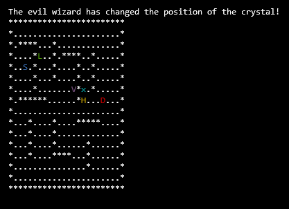

# SimpleCppMaze

A simple C++ maze game , with support for multiple players.

## How to play
* Make sure ncurses is installed.
* cd to the directory containing the games files.
* compile the game with `g++ *.cpp $(ncursesw5-config --cflags --libs) -o maze.out`
* run the game with `./maze.out maze.txt`
* Use the arrow keys to move and the space bar to stay the same place.
* The goal is to get to the crystal `x`

## Features
* The game is simple and easy to play.
* Support for custom mazes given as an argument.
* Support for multiple players and ai players.
    * Default config:
        * 1 keyboard controlled player. (H symbol)
        * 4 ai controlled player. (L,D,S,V symbols)
* Uses ncurses to display & interact with the game.
    * Ncurses is configured to support unicode.

## Screenshots

